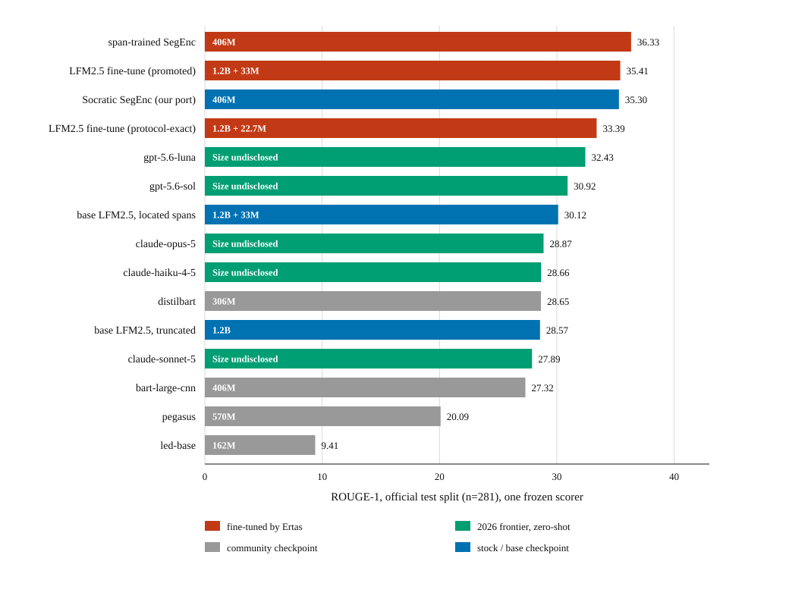

# Retrieved-Span Training for Efficient Query-Focused Meeting Summarization on QMSum

Code, frozen protocol, per-query predictions and released models for the paper
(Ertas AI, in preparation).

The system is a two-stage pipeline for query-focused meeting summarization on
[QMSum](https://github.com/Yale-LILY/QMSum): a cross-encoder **locator** scores fixed-width
windows of the transcript against the query and packs the best ones to a word budget, then a
LoRA fine-tuned **summarizer** (LFM2.5 1.2B) answers the query from those spans alone. Every
number in the paper traces to a row in `results/rows/` and a per-query prediction file in
`results/preds/`, all generated under the frozen protocol in `eval/protocol.py` and scored by
one frozen scorer.

## Released models

| Artifact | Hub repo | Pinned revision |
|---|---|---|
| Summarizer LoRA adapter | [ErtasAI/qmsum-summarizer-lfm2.5-1.2b-lora](https://huggingface.co/ErtasAI/qmsum-summarizer-lfm2.5-1.2b-lora) | `7d73ab65` |
| Locator, promoted (L12, 375-word windows) | [ErtasAI/qmsum-locator-minilm-l12-w375](https://huggingface.co/ErtasAI/qmsum-locator-minilm-l12-w375) | `f54ed53f` |
| Locator, protocol-exact (L6, 900-word windows) | [ErtasAI/qmsum-locator-minilm-l6-w900](https://huggingface.co/ErtasAI/qmsum-locator-minilm-l6-w900) | `a1b9e64d` |
| Span-trained SegEnc, effective epoch 8 | [ErtasAI/qmsum-summarizer-segenc-406m-spans](https://huggingface.co/ErtasAI/qmsum-summarizer-segenc-406m-spans) | `26abdfc1` |
| Stock Socratic SegEnc (third party) | [Salesforce/socratic-pretraining-qmsum](https://huggingface.co/Salesforce/socratic-pretraining-qmsum) | `d127cbc5` |

`scripts/fetch_artifacts.py` downloads the three pipeline artifacts by default. Add
`--include-comparisons` to fetch both SegEnc checkpoints as well. Every download is pinned to
the revision above and its weight file is verified by SHA256.

## Replicate the headline rows

Requirements: Python 3.12, an NVIDIA GPU (peak inference VRAM is 5.73 GB; any 8 GB card is
comfortable), about 4 GB of downloads (base model, artifacts, data). No API keys.

```bash
git clone https://github.com/ErtasAI/qmsum-retrieved-span-training
cd qmsum-retrieved-span-training
python -m venv .venv
# Windows: .venv\Scripts\activate     Linux/macOS: source .venv/bin/activate
pip install torch==2.11.0 --index-url https://download.pytorch.org/whl/cu128
pip install -r requirements.txt

# 1. Data: fetch QMSum from the official repo and build the normalized splits
python data/download_qmsum.py
python -m data.normalize

# 2. Models: fetch the released artifacts at pinned revisions, hash-verified
python scripts/fetch_artifacts.py

# 3. Run the promoted configuration on the official test split (~15 min on an RTX 5070 Ti)
python -m pipeline.run_pipeline --adapter checkpoints/m3-fusion-lfm2.5-1.2b/final \
    --split test --locator crossencoder \
    --locator-ckpt checkpoints/locator-crossencoder-w375-l12 \
    --chunk-words 375 --span-budget 2000 \
    --out results/preds/repro-promoted-test.jsonl

# 4. Score it (first --bertscore run downloads roberta-large, ~1.4 GB)
python -m eval.run_eval --pred results/preds/repro-promoted-test.jsonl \
    --split test --run-id repro-promoted-test --bertscore
```

For the protocol-exact row, the pipeline's defaults ARE the frozen protocol, so step 3 needs
no locator arguments:

```bash
python -m pipeline.run_pipeline --adapter checkpoints/m3-fusion-lfm2.5-1.2b/final \
    --split test --out results/preds/repro-protocol-test.jsonl
python -m eval.run_eval --pred results/preds/repro-protocol-test.jsonl \
    --split test --run-id repro-protocol-test --bertscore
```

For a two-minute path check before committing to the full split, add `--limit 5` to the
pipeline command and `--allow-partial` to the scoring command.

The two base-model ablation rows reproduce the same way, with `--base-model` in place of
`--adapter` (no fine-tuned weights involved; the model gets its own chat template):

```bash
python -m pipeline.run_pipeline --base-model LiquidAI/LFM2.5-1.2B-Instruct --split test \
    --locator crossencoder --locator-ckpt checkpoints/locator-crossencoder-w375-l12 \
    --chunk-words 375 --span-budget 2000 --out results/preds/repro-zs-spans-test.jsonl
python -m pipeline.run_pipeline --base-model LiquidAI/LFM2.5-1.2B-Instruct --split test \
    --locator none --truncate-words 4500 --out results/preds/repro-zs-trunc-test.jsonl
```

### Reproduce the executable SegEnc comparison

Fetch the optional comparison checkpoints, then retain each checkpoint's own chunk regime:

```bash
python scripts/fetch_artifacts.py --include-comparisons

# Stock Salesforce checkpoint, full-transcript regime: 35.30 ROUGE-1 in our port
python -m eval.segenc --model-dir results/external/socratic-qmsum \
    --split test --mode full --bf16 --max-num-chunks 32 \
    --out results/preds/repro-segenc-stock-test.jsonl

# Our span-trained checkpoint, locator-packed spans at inference: 36.33 ROUGE-1
python -m eval.segenc --model-dir checkpoints/segenc-spans-c8/epoch8 \
    --split test --mode spans --bf16 --max-num-chunks 8 \
    --span-budget 2000 --chunk-words 375 \
    --locator-ckpt checkpoints/locator-crossencoder-w375-l12 \
    --out results/preds/repro-segenc-spans-test.jsonl
```

Score either file with `python -m eval.run_eval` as in the headline path above. The released
span-trained checkpoint is one lineage: four epochs at `3e-5`, followed by four continuation
epochs from epoch 4 at `1e-5`. Its training examples use gold-overlapping span windows built by
`data/build_segenc_data.py`, byte-identical to the span-regime summarizer training construction;
inference uses locator-packed spans. The executable recipe is:

```bash
python -m training.segenc_recipe --dry-run  # inspect both exact stage commands
python -m training.segenc_recipe            # run stages 1-4 then 5-8
```

### Expected results

Full official test split, n=281, greedy decoding:

| Configuration | Published row | R1 | R2 | R-L | R-Lsum | BERTScore |
|---|---|---|---|---|---|---|
| Promoted | `results/rows/loc-w375-l12-b2000-test.json` | 0.3541 | 0.1228 | 0.2463 | 0.3136 | 0.8733 |
| Protocol-exact | `results/rows/m3-fusion-lfm2.5-1.2b-test.json` | 0.3339 | 0.1065 | 0.2283 | 0.2930 | 0.8680 |

This exact path was verified on 2026-08-12: a fresh extraction of this repo, the data build,
the hash-verified artifact fetch and the promoted-configuration run reproduced all 281
predictions byte-identically against the published prediction file and matched the published
row to full float precision (on the GPU family that produced the rows). On different
hardware, small numeric drift in the last decimal places is possible; the ROUGE figures
should match to about three decimal places. Wall-clock
latency reproduces only to about 15% even on identical hardware, so treat any latency
comparison under 20% as noise.

### The full comparison, one frozen scorer

The paper's headline findings are orderings, and they mean something because every row below
was produced by us and scored by the same frozen scorer on the same official test split
(n=281). Sorted by ROUGE-1:



Figure 1 is an executable, apples-to-apples comparison: it uses the stock Socratic SegEnc
checkpoint run through our port (35.30), not the 38.60 obtained by applying our scorer to the
authors' released predictions. The latter remains in Table 1 below because it is the strongest
published specialist result. `python results/build_figure1.py` deterministically rebuilds the
SVG from `results/rows/`.

| System | Params | Reads | R1 | R2 | R-Lsum | BERTScore | API cost, full split² |
|---|---|---|---|---|---|---|---|
| Socratic SegEnc (Pagnoni et al., ACL 2023), authors' released predictions¹ | 406M | transcript up to ~11.8k words | 0.3860 | 0.1391 | 0.3371 | 0.8737 | N/A |
| SegEnc, trained by us for the span regime | 406M | 2,000 locator-packed words at inference | 0.3633 | 0.1272 | 0.3217 | 0.8710 | N/A |
| **This system, promoted configuration** | **1.2B + 33M** | **2,000 located words** | **0.3541** | **0.1228** | **0.3136** | **0.8733** | **N/A** |
| **This system, protocol-exact** | **1.2B + 23M** | **3,000 located words** | **0.3339** | **0.1065** | **0.2930** | **0.8680** | **N/A** |
| gpt-5.6-luna, zero-shot² | Size undisclosed | full transcript | 0.3243 | 0.0789 | 0.2749 | 0.8608 | $2.05 |
| gpt-5.6-sol, zero-shot² | Size undisclosed | full transcript | 0.3092 | 0.0694 | 0.2610 | 0.8583 | $10.23 |
| base LFM2.5-1.2B, zero-shot, our located spans⁴ | 1.2B + 33M | 2,000 located words | 0.3012 | 0.0670 | 0.2504 | 0.8687 | N/A |
| claude-opus-5, zero-shot² | Size undisclosed | full transcript | 0.2887 | 0.0843 | 0.2501 | 0.8522 | $16.20 |
| claude-haiku-4-5, zero-shot² | Size undisclosed | full transcript | 0.2866 | 0.0842 | 0.2419 | 0.8431 | $2.35 |
| distilbart-cnn-12-6, community checkpoint³ | 306M | truncated to model context | 0.2865 | 0.0654 | 0.2550 | 0.8546 | N/A |
| base LFM2.5-1.2B, zero-shot, truncated transcript⁴ | 1.2B | first 4,500 words | 0.2857 | 0.0555 | 0.2455 | 0.8607 | N/A |
| claude-sonnet-5, zero-shot² | Size undisclosed | full transcript | 0.2789 | 0.0753 | 0.2398 | 0.8478 | $6.50 |
| bart-large-cnn, community checkpoint³ | 406M | truncated to model context | 0.2732 | 0.0565 | 0.2408 | 0.8513 | N/A |
| pegasus-cnn, community checkpoint³ | 570M | truncated to model context | 0.2009 | 0.0445 | 0.1723 | 0.8344 | N/A |
| led-base, community checkpoint³ | 162M | truncated to model context | 0.0941 | 0.0237 | 0.0796 | 0.7818 | N/A |

¹ The one row we did not generate: scored from the authors' released prediction files under our
frozen scorer, gated on first reproducing their reported score. Their model reads the transcript
up to its ~11,800-word training-time truncation. Running the stock released checkpoint end to end
through our port scores 35.30, 3.3 ROUGE-1 below the released predictions. Precision and padding
checks did not close the gap; it may arise from preprocessing, decoding, implementation, or
checkpoint differences. We therefore use 35.30 only for within-port Figure 1 comparisons and
retain 38.60 as the authors-prediction Table 1 result. Neither number is silently substituted for
the other.
² Frontier baselines read the full untruncated transcript (the 40,000-word budget exceeds the
longest transcript in the split), zero-shot, non-reasoning regime, same prompt template as
ours. Output length was not experimentally controlled across proprietary APIs, and the study
includes no human or factuality evaluation; ROUGE and BERTScore should not be read as complete
quality measures. API cost is the batch price for the full 281-query split, recorded at collect time
(2026-07-27); per-row figures live in `cost_usd_total` in `results/rows/`. N/A means no API
in the loop: those rows run on local GPU time (a full-split run of this system takes about
11 minutes on an RTX 5070 Ti).
³ Query-prefixed transcript truncated to each checkpoint's own encoder context
(`eval/hf_rows.py`).
⁴ The promoted system's ablation cells, pre-declared and run 2026-08-12: the same base model
with no adapter, zero-shot under its own chat template. Fine-tune effect at identical retrieval:
+5.29 ROUGE-1, 95% CI [+4.02, +6.56]. Locator effect at fixed base model is split-dependent and
the two splits are always quoted together: +1.55 [+0.58, +2.51] on test, +0.29 [-0.64, +1.19] on
validation.

Four findings carry the paper:

The central ROUGE uncertainty analysis is a 10,000-draw meeting-cluster bootstrap over 35
meetings, retaining all nested queries together. It keeps the headline conclusions while widening
the intervals: ours versus gpt-5.6-luna is +2.98 [+1.39, +4.63], the published specialist's
advantage over ours is +3.19 [+2.01, +4.47], its advantage over gpt-5.6-luna is +6.17
[+4.84, +7.45], and span-trained SegEnc versus ours is +0.93 [-0.27, +2.22]. The exact records,
prediction hashes, seed, and draw count are committed under `results/intervals/`; query-resampled
supporting intervals are retained there separately.

- **The fine-tuned 1.2B beats all five frontier zero-shot baselines on ROUGE-1 and
  BERTScore**, paired-bootstrap intervals excluding zero, while reading 2,000 located words
  against their full transcript.
- **A 2023 406M specialist beats every 2026 frontier model by 6.2 ROUGE-1** under one scorer.
  It also beats this system by 3.2 ROUGE-1, an interval firmly excluding zero, while BERTScore
  cannot separate the two systems. That metric disagreement is one of the paper's measurement
  findings.
- **The 406M SegEnc trained for the span regime is not statistically separated from the 1.2B
  system on the reported metrics** (all intervals cross zero), but this does not establish
  equivalence. Including the shared locator, it uses 2.8x fewer parameters and 2.16x less peak
  inference VRAM. Its stock checkpoint falls from 35.30 on full transcripts to 29.00 on located
  spans in our port, then training on the matched span construction raises it to 37.05 on
  validation and 36.33 on test.
- **The distance between the system and its own base model is the fine-tune: +5.29 ROUGE-1 at
  identical retrieval** (validation agrees at +6.39). Handing the untuned model located spans
  instead of a truncated transcript moves quality by at most +1.55 (and the validation split
  cannot distinguish it from zero), while cutting latency 1.8x and peak VRAM 2.9x, so the
  locator's quality value appears only in combination with training on the regime.

`results/CHART.md` holds every row the project scored, including the validation sweeps, plus
a separate, deliberately incommensurable table of published numbers from the literature.
Published QMSum numbers use ROUGE implementations the benchmark never specified, so they must
never share a column with these rows; the paper measures the cross-implementation delta.

## The prompt

Every generative row is produced from one template, frozen in `eval/protocol.py` and asserted
byte for byte by `tests/test_protocol_frozen.py`, so a replication never has to reconstruct it
from a description:

```text
You are given a meeting transcript and a query. Answer the query with a concise summary based only on the transcript.

Query: {query}

Transcript:
{transcript}

Summary:
```

The first sentence is a single line in the source; the blank lines are part of the template.
`{transcript}` is meeting text rendered one utterance per line as `speaker: text`
(`protocol.format_transcript`), and what fills it is the only difference between conditions:

| Rows | `{transcript}` contents | How the model receives it |
|---|---|---|
| System rows (adapter) | Located windows in transcript order, truncated to the span budget: 2,000 words promoted, 3,000 protocol-exact | Raw completion: the filled template plus one trailing space, tokenized directly; the model continues after `Summary: ` (`pipeline/run_pipeline.py`) |
| Frontier baselines | Full transcript under the 40,000-word budget, which binds on no transcript in either split | Sole user message of a chat request, no system message (`eval/baselines_openai.py`, `eval/baselines_anthropic.py`) |
| Base-model ablation cells | Located spans, or the transcript truncated to 4,500 words (`--locator none --truncate-words 4500`) | Sole user message through the model's own chat template (`--base-model` path in `pipeline/run_pipeline.py`) |

Training uses the identical construction: filled template plus one space, loss masked to the
response tokens, EOS appended (`encode` in `training/train_lora.py`), so the prompt bytes at
inference match the prompt bytes at training. The DialogLED baseline trains and evaluates on the
filled template as its encoder input (`training/train_seq2seq.py`). Two row families use their
own input formats instead: the community checkpoints take `query </s> transcript` matching their
published fine-tuning convention (`eval/hf_rows.py`), and the SegEnc rows use that architecture's
own query encoding (`eval/segenc.py`). The locator consumes raw query and window text pairs, with
no prompt template involved (`pipeline/locator_crossencoder.py`).

## Optional legs (API keys)

The frontier baselines and the fact-level judge are re-runnable but need keys. Copy
`.env.example` to `.env` and fill in what you need; each key's role is documented in that
file. Cached baseline predictions for all five frontier rows are already in `results/preds/`,
so you can rescore them without any key:

```bash
python -m eval.run_eval --pred results/preds/baseline-gpt-5.6-luna-test.jsonl \
    --split test --run-id rescore-luna --bertscore
```

## Repo map

| Path | What it is |
|---|---|
| `eval/protocol.py` | The frozen protocol: seed, budgets, prompt template. Locked 2026-07-23; `tests/test_protocol_frozen.py` enforces it |
| `eval/scorer.py`, `eval/run_eval.py` | The frozen scorer (rouge-score 0.1.2, bert-score 0.3.13) and the row writer |
| `eval/paired_bootstrap.py` | Query-paired and meeting-cluster bootstrap CIs for any two prediction files |
| `pipeline/` | Chunker, both locators, and the end-to-end pipeline runner |
| `training/train_lora.py` + `training-configs/` | QLoRA training with full instrumentation; one YAML per trained configuration |
| `data/` | QMSum download, normalization, and training-data builders |
| `results/rows/` | One JSON per scored run, the paper's tables' source of truth |
| `results/preds/` | Per-query predictions for every row, including all baselines |
| `results/intervals/` | Committed query and meeting-cluster intervals with prediction hashes |
| `external/query-focused-sum/` | Ported model classes for the Socratic SegEnc comparison rows (BSD-3, Salesforce; licence retained) |
| `tests/` | The test suite; `pytest` from the repo root |

## Retraining caveats, stated up front

The released adapter is the artifact the paper measures; retraining does not reproduce it.
The only completed alternate summarizer seed gives a two-run observed range of 1.59 ROUGE-1;
that is not an estimate of a training-seed distribution. On the 16 GB card the paper
used, training runs in host-memory fallback: of four attempted seeds, one completed. Training
takes about five and a half GPU-hours when it completes. The locators are cheap to retrain
(about 7 and 1.5 minutes) but a retrain is likewise a different checkpoint. Use
`scripts/fetch_artifacts.py` for replication; retrain only to study the training itself.

## Tests

```bash
python -m pytest tests/
```

The suite runs without a GPU and without API keys, but expects the data step above to have
run first (it exercises the builders and the built splits). From a fresh clone plus the data
step: 351 passed, 2 skipped.

## Licences

- **Code:** Apache 2.0 (`LICENSE`).
- **`external/query-focused-sum/`:** BSD 3-Clause, Salesforce (`external/query-focused-sum/LICENSE.txt`), ported from
  [salesforce/query-focused-sum](https://github.com/salesforce/query-focused-sum).
- **Models:** each released artifact carries its licence on its Hub page. The locators are
  Apache 2.0; the summarizer adapter inherits the LFM Open License v1.0 from its base model,
  which caps free commercial use at US$10M annual revenue; the span-trained SegEnc inherits
  BSD 3-Clause from `Salesforce/socratic-pretraining-qmsum`.
- **Third-party predictions:** `results/preds/row-socratic-segenc-{test,val}.jsonl` hold the
  prediction files released with
  [`Salesforce/socratic-pretraining-qmsum`](https://huggingface.co/Salesforce/socratic-pretraining-qmsum)
  (Pagnoni et al., ACL 2023), rescored here under our own protocol. They are redistributed under
  that model's BSD 3-Clause licence, whose text, conditions and disclaimer are retained at
  `external/query-focused-sum/LICENSE.txt` (Copyright (c) 2021, Salesforce.com, Inc.). Neither the
  name of Salesforce.com nor the names of its contributors are used to endorse this work.
- **Data:** QMSum is MIT; it draws on the AMI and ICSI meeting corpora (CC BY 4.0). This repo
  redistributes no transcript text; `data/download_qmsum.py` fetches it from the official
  QMSum repo.

## Citation

The paper is in preparation; a citation entry will land here with the preprint. Until then,
if you use the pipeline or the released models, please cite QMSum as well:

```bibtex
@inproceedings{zhong2021qmsum,
  title     = {{QMSum}: A New Benchmark for Query-based Multi-domain Meeting Summarization},
  author    = {Zhong, Ming and Yin, Da and Yu, Tao and Zaidi, Ahmad and Mutuma, Mutethia and
               Jha, Rahul and Awadallah, Ahmed Hassan and Celikyilmaz, Asli and Liu, Yang and
               Qiu, Xipeng and Radev, Dragomir},
  booktitle = {Proceedings of NAACL-HLT},
  year      = {2021}
}
```

---

Released by [Ertas AI](https://www.ertas.ai). We build custom small models that run on-device
and in your own infrastructure.
